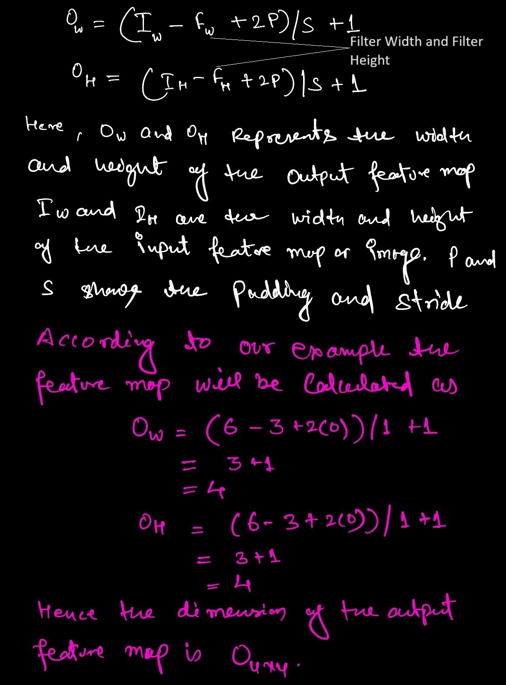

## Overview
Recently while I was reading about the Self Attention Model that was used over images. I heard about this term, 1x1 convolutions. It was being used in calculating the Key, Query and Value. I first find it funny but when I went deeper to understand this guy. I was impressed.
I crafted a three step process to understand this concept. What is 1x1 convolution, why it is useful and where all the places it is utilized.

### What is 1x1 convolution
#### Some Background on Convolution Operation
Well in order to understand the 1x1 convolution, we need to first understand the convolution operation and the complexity involved in the underlaying operation that it uses.

Let's say we have a RGB image of dimension 6x6x3 and we want to apply a convolution layer having filter size 3x3, number of filters as 2, activation function as ReLU. Lets say this produces the output that is represented by 'O'. The mathematical equation to understand this is given below. The filter is represent by 'F' while the super script shows the Filter number the sub script denotes the input channel.




Lets validate these numbers such as output feature map dimension and the number of learning parameter by implementing the same example in tensorflow.

```python:title=Conv2D.py
import tensorflow as tf
from tensorflow.keras.models import Sequential
from tensorflow.keras.layers import Conv2D

# Define the model
model = Sequential()

# Add a 2D convolution layer
model.add(Conv2D(filters=2, kernel_size=(3, 3), activation='relu', input_shape=(6, 6, 3)))

# Summary of the model
model.summary()
```

The output of the network is displayed below.


#### Challenges with normal convolution filters
> 1. Reduces the feature dimension
This is the 
> 2. High Complexity
> 3. Lacking in adding the non-linearity

#### What is 1x1 convolution

### 1x1 Applications

