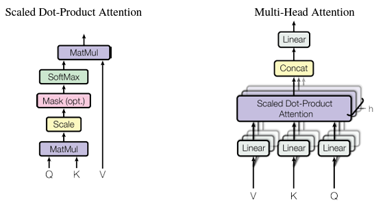

## Overview
This article would discuss the following concepts
> 1. Basic intuation of attention model
> 2. Attention History
> 3. Mathematics behind the attention model
> 4. Implementation of attention mechanism
> 5. Use of Tensorflow ``tf.keras.layers.MultiHeadAttention`` API
Without further delay, lets deep dive into what is attention mechanism, why it is so popular?

## Basic intuation of attention model
Imagine you are reading a book, and you come across a character whose actions are essential to understand the current plot. To make sense of what's happening, you need to remember previous details about this character. Here’s how the attention mechanism works in this context: <br>
<font color=#64ffda><strong>Query:</strong></font> Think of the query as the question you're asking while reading. For example, "What has this character done before?" <br>
<font color=#64ffda><strong>Key:</strong></font> The key is like an index or a set of clues that help you find the right information in the book. It's the reference to different points in the story where this character is mentioned. <br>
<font color=#64ffda><strong>Value:</strong></font> The value is the actual information you need about the character, like their past actions and traits.

If we explain the same example in terms of python data types then it would be something similar to as described in the below example. The query is the question that we are looking for, key is the reference that can be ``mahabharata_characters`` and value would be the value of the query. So if we are looking for the character ``Ashwatthama`` then the ``mahabharata_characters`` would be the reference, treated as key and the value as ``The formidable warrior and son of Dronacharya, known for his unrelenting pursuit of revenge against the Pandavas.`` is the value. <br>
```python:title=Dictionary.py
# dictionary of characters and their description
mahabharata_characters = {
    "Arjuna": "The peerless archer, whose valor and skill were unmatched on the battlefield of Kurukshetra",
    "Krishna": "The divine charioteer and guide to Arjuna, whose wisdom and counsel in the Bhagavad Gita are legendary.",
    "Bhishma": "The grand patriarch of the Kuru dynasty, renowned for his vow of celibacy and unparalleled warrior prowess.",
    "Draupadi": "The fiery princess and wife of the Pandavas, whose dignity and strength became a rallying point in their quest for justice.",
    "Karna": "The tragic hero and unparalleled warrior, known for his unwavering loyalty to Duryodhana and his inner conflict regarding his true lineage."
    "Ashwatthama": "The formidable warrior and son of Dronacharya, known for his unrelenting pursuit of revenge against the Pandavas."
}
```
Build upon this intuation, attention mechanism keeps the track of long sequences and give more weightsage to only certain portion who are useful for the token.

## Attention History
The concept of attention in machine learning was first introduced by Dzmitry Bahdanau, Kyunghyun Cho, and Yoshua Bengio in their 2014 paper titled "Neural Machine Translation by Jointly Learning to Align and Translate." This paper introduced the attention mechanism as a solution to the limitations of traditional encoder-decoder models, particularly in handling long sequences.
### Early Development
The first existence of the attention mechanism can be traced back to 2014 with the aforementioned paper. The core idea was to allow the model to focus on different parts of the input sequence while generating the output, improving the handling of long dependencies in sequences.
### Progress and Evolution
Since its inception, attention mechanisms have seen rapid development and widespread adoption across various domains. The following milestones highlight the progress in the field: <br>
<font color=#64ffda><strong>2015: </strong></font> Bahdanau et al.'s attention mechanism gained popularity and was quickly adopted in other sequence-to-sequence tasks. <br>
<font color=#64ffda><strong>2017: </strong></font> The introduction of the Transformer model by Vaswani et al. in their paper "Attention is All You Need" marked a significant advancement. The Transformer model relies entirely on self-attention mechanisms, eliminating the need for recurrent networks. This model became the foundation for many state-of-the-art models. <br>
<font color=#64ffda><strong>2018:</strong></font> OpenAI's GPT (Generative Pre-trained Transformer) demonstrated the power of large-scale unsupervised pre-training followed by fine-tuning on specific tasks. <br>
<font color=#64ffda><strong>2018:</strong></font> BERT (Bidirectional Encoder Representations from Transformers) by Google introduced a novel way to pre-train transformers in a bidirectional manner, significantly improving performance on a wide range of NLP tasks. <br>
<font color=#64ffda><strong>2020:</strong></font> The release of GPT-3 by OpenAI showcased the potential of extremely large models, setting new benchmarks in NLP.

## Mathematics behind the attention model
If we see the architecture proposed in the paper[^1], it has the following component ``Scale``, ``Mask (Opt)``, ``Softmax`` and ``matmul``.

## Implementation of attention mechanism

## Use of Tensorflow ``tf.keras.layers.MultiHeadAttention`` API

## References
[^1]: Vaswani, A., Shazeer, N., Parmar, N., Uszkoreit, J., Jones, L., Gomez, A. N., ... & Polosukhin, I. (2017). Attention is all you need. Advances in neural information processing systems, 30.


